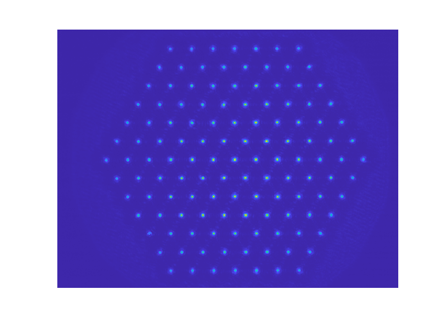

# MSHWFS - Modal-Shack-Hartmann-Wavefront-Sensor toolbox

[](https://doi.org/10.4233/uuid:f98b3b8f-bdb8-41bb-8766-d0a15dae0e27)



MATLAB toolbox to estimate wavefronts from Shack-Hartmann (SHWFS) images. This toolbox implements the modal-based wavefront reconstruction method described in Section 1.3.2 of [[1]](#1). It also contains code to generate and plot Zernike polynomials as defined by Noll [[2]](#2).

## Main Features

- automatic calibration from a given SHWFS reference image
- handles an arbitrary arrangement and number of subapertures
- estimates an arbitrary number of Zernike modes
- computes the definite integrals of the gradients of the Zernike modes within each subaperture
- contains an example with real SHWFS images 

## Requirements

- MATLAB
- a SHWFS reference image for calibration

## Usage

### Calibration
The calibration step is necessary to lay the grids for your particular arrangement of subapertures, select the pupil size, and to enable or disable single subapertures. For this step you should use a reference SHWFS image, i.e., an image taken with a reference beam that is aberration free.

To perform the calibration, open `calibration.m`,
```
    >> cd examples/
    >> edit calibration.m
```
You can run the calibration using the example SHWFS reference image found in
`examples/data/sh_flat.mat`. To use your own SHWFS reference image:
- adjust the parameters for your lenslet array
- replace `load sh_flat_bg.mat` with your background reference image (dark frame).
- replace `load sh_flat.mat` with your SHWFS reference image, i.e., an image taken with your SHWFS when no aberration is present
- run the script adjusting the parameters if necessary. For example, you may want to disable some subapertures. You can do this by zeroing the corresponding pixels in the SHWFS reference image.

### Wavefront estimation
Once the calibration is complete, you can estimate the wavefront from an arbitrary SHWFS image. An example is provided in `reconstruction.m`. To use your own images, just replace `load img.mat`.

## References
<a id="1">[1]</a> J. Antonello, "Optimisation-based wavefront sensorless adaptive optics for microscopy," [Ph.D. thesis](https://doi.org/10.4233/uuid:f98b3b8f-bdb8-41bb-8766-d0a15dae0e27), Delft University of Technology (2014). 

<a id="2">[2]</a> Robert J. Noll, "Zernike polynomials and atmospheric turbulence," J. Opt. Soc. Am. [66](https://doi.org/10.1364/JOSA.66.000207), 207-211 (1976).
